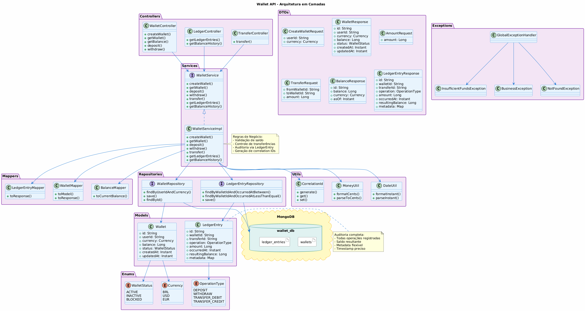
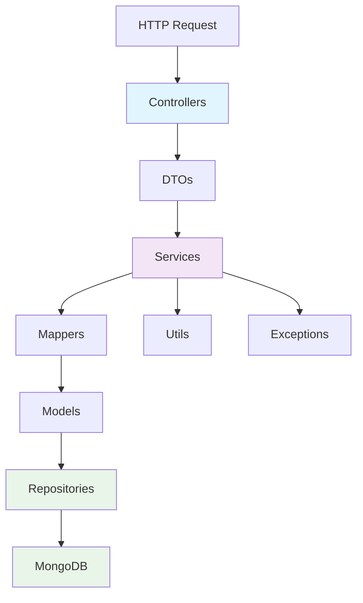

# 💳 Wallet API

<div align="center">

[](https://openjdk.java.net/)
[](https://spring.io/projects/spring-boot)
[](https://www.mongodb.com/)
[](https://maven.apache.org/)
[](https://www.docker.com/)
[](LICENSE)

**Uma API robusta e completa para gerenciamento de carteiras digitais**  
*Construída com Java 17, Spring Boot 3 e MongoDB*

[🚀 Quick Start](#-quick-start) • [📖 Documentação](#-documentação) • [🐳 Docker](#-docker) • [🧪 Testes](#-testes) • [📊 Arquitetura](#-arquitetura)

</div>

---

## 🎯 **Sobre o Projeto**

A **Wallet API** é uma solução completa para gerenciamento de carteiras digitais que oferece:

- ✅ **Arquitetura robusta** em camadas bem estruturadas
- ✅ **Auditoria completa** de todas as operações financeiras
- ✅ **Múltiplas moedas** (BRL, USD, EUR) com validação
- ✅ **Testes abrangentes** (unitários, integração, web)
- ✅ **Docker ready** para produção
- ✅ **Documentação interativa** com Swagger/OpenAPI

## 📋 **Índice**

<details>
<summary>🗂️ <strong>Clique para expandir</strong></summary>

- [🎯 Sobre o Projeto](#-sobre-o-projeto)
- [⚡ Quick Start](#-quick-start)
- [🏗️ Arquitetura](#️-arquitetura)
- [🚀 Tecnologias](#-tecnologias)
- [💳 Funcionalidades](#-funcionalidades)
- [🐳 Docker](#-docker)
- [🔗 Endpoints da API](#-endpoints-da-api)
- [📊 Estrutura do Projeto](#-estrutura-do-projeto)
- [🧪 Testes](#-testes)
- [📖 Documentação](#-documentação)
- [📈 Exemplos de Uso](#-exemplos-de-uso)
- [🗃️ Modelo de Dados](#️-modelo-de-dados)
- [🛡️ Tratamento de Erros](#️-tratamento-de-erros)
- [🔧 Configuração](#-configuração)
- [🚀 Melhorias Futuras](#-melhorias-futuras)
- [📝 Licença](#-licença)

</details>

---

## ⚡ **Quick Start**

### 🏃‍♂️ **Execução Rápida com Docker** (Recomendado)

```bash
# 1. Clone o repositório
git clone <repo-url>
cd wallet-api

# 2. Execute com um comando
./start.sh

# 3. Acesse a aplicação
open http://localhost:8080/swagger-ui.html
```

### 🛠️ **Desenvolvimento Local**

<details>
<summary>📋 <strong>Pré-requisitos e instruções</strong></summary>

**Requisitos:**
- Java 17+
- MongoDB 5.0+
- Maven 3.6+

**Execução:**
```bash
# Certifique-se que o MongoDB está rodando na porta 27017
./mvnw spring-boot:run
```

**URLs importantes:**
- **API**: http://localhost:8080
- **Swagger UI**: http://localhost:8080/swagger-ui.html
- **Health Check**: http://localhost:8080/actuator/health

</details>

---

## 🏗️ **Arquitetura**

### 📊 **Diagrama Completo**

<div align="center">



*Diagrama UML completo da arquitetura em camadas*

</div>

### 🔄 **Fluxo de Dados**

O projeto segue uma **arquitetura em camadas** bem definida:



### 🎯 **Princípios Arquiteturais**

- **🔄 Separação de Responsabilidades**: Cada camada tem função específica
- **🔗 Inversão de Dependência**: Services dependem de abstrações
- **📊 Auditoria Completa**: LedgerEntry registra todas operações
- **🛡️ Tratamento Padronizado**: GlobalExceptionHandler unificado
- **🔄 Mapeamento Automático**: Conversões DTO ↔ Model otimizadas

---

## 🚀 **Tecnologias**

<div align="center">

### **Core Stack**

| Tecnologia | Versão | Função |
|------------|--------|--------|
| ☕ **Java** | 17+ | Linguagem principal |
| 🌱 **Spring Boot** | 3.0+ | Framework web e DI |
| 🍃 **Spring Data MongoDB** | 3.0+ | Persistência de dados |
| ✅ **Spring Validation** | 3.0+ | Validação de entrada |
| 📊 **Spring Actuator** | 3.0+ | Monitoramento |

### **Ferramentas e Bibliotecas**

| Tecnologia | Função |
|------------|--------|
| 🗄️ **MongoDB** | Base de dados NoSQL |
| 🔄 **MapStruct** | Mapeamento DTO ↔ Model |
| 📝 **OpenAPI/Swagger** | Documentação interativa |
| 📦 **Lombok** | Redução de boilerplate |
| 🧪 **JUnit 5 + Mockito** | Testes unitários |
| 🐳 **Testcontainers** | Testes de integração |

</div>

---

## 💳 **Funcionalidades**

<div align="center">

### ✅ **Gestão de Carteiras**
**Criação** • **Consulta de saldo** • **Múltiplas moedas** • **Status control**

### 💰 **Operações Financeiras**
**Depósitos** • **Saques** • **Transferências** • **Validação em tempo real**

### 📊 **Auditoria e Controle**
**Extrato completo** • **Saldo histórico** • **Correlation IDs** • **Metadata flexível**

</div>

<details>
<summary>📋 <strong>Detalhes das funcionalidades</strong></summary>

### ✅ **Gestão de Carteiras**
- **Criação de carteiras** por usuário e moeda
- **Consulta de saldo** atual e histórico
- **Múltiplas moedas** (BRL, USD, EUR)
- **Status de carteira** (ACTIVE, INACTIVE, BLOCKED)

### 💰 **Operações Financeiras**
- **Depósitos** com metadata flexível
- **Saques** com validação de saldo
- **Transferências** entre carteiras com auditoria completa
- **Validação de fundos** em tempo real

### 📊 **Auditoria e Controle**
- **Extrato completo** de todas as operações
- **Saldo histórico** por data/hora específica
- **Correlation IDs** para rastreabilidade
- **Metadata flexível** para contexto adicional

</details>

---

## 🐳 **Docker**

### 🚀 **Execução com Docker Compose**

```bash
# Subir ambiente completo
docker-compose up -d

# Ver logs em tempo real
docker-compose logs -f

# Parar serviços
./stop.sh
```

### 📦 **Serviços Incluídos**

| Serviço | Porta | Descrição |
|---------|-------|-----------|
| **Wallet API** | 8080 | Aplicação principal |
| **MongoDB** | 27017 | Base de dados |
| **Mongo Express** | 8081 | Interface web (admin/admin123) |

### 🔧 **Características Docker**

- ✅ **Health checks** automáticos
- ✅ **Volumes persistentes** para dados
- ✅ **Inicialização automática** do MongoDB
- ✅ **Scripts inteligentes** de start/stop
- ✅ **Configuração otimizada** para produção

**📖 Documentação completa**: [docs/development.md](docs/development.md)

---

## 🔗 **Endpoints da API**

<div align="center">

### 💳 **Gestão de Carteiras**

| Método | Endpoint | Descrição |
|--------|----------|-----------|
| `POST` | `/api/v1/wallets` | Criar nova carteira |
| `GET` | `/api/v1/wallets/{id}` | Buscar carteira por ID |
| `GET` | `/api/v1/wallets/{id}/balance` | Consultar saldo atual |
| `GET` | `/api/v1/wallets/{id}/balance/history` | Saldo histórico |

### 💰 **Operações Financeiras**

| Método | Endpoint | Descrição |
|--------|----------|-----------|
| `POST` | `/api/v1/wallets/{id}/deposit` | Realizar depósito |
| `POST` | `/api/v1/wallets/{id}/withdraw` | Realizar saque |
| `POST` | `/api/v1/transfers` | Transferir entre carteiras |

### 📊 **Extrato e Auditoria**

| Método | Endpoint | Descrição |
|--------|----------|-----------|
| `GET` | `/api/v1/wallets/{id}/ledger` | Extrato de movimentações |

</div>

---

## 📊 **Estrutura do Projeto**

<details>
<summary>🗂️ <strong>Visualizar estrutura completa</strong></summary>

```
src/main/java/com/hlaff/wallet_api/
├── 📁 config/          # Configurações (OpenAPI, MongoDB, Web)
│   ├── MongoConfig.java
│   ├── OpenApiConfig.java
│   └── WebConfig.java
├── 📁 controller/      # Endpoints REST
│   ├── WalletController.java
│   ├── TransferController.java
│   └── LedgerController.java
├── 📁 dto/            # DTOs de request/response
│   ├── CreateWalletRequest.java
│   ├── WalletResponse.java
│   ├── AmountRequest.java
│   ├── TransferRequest.java
│   ├── BalanceResponse.java
│   └── LedgerEntryResponse.java
├── 📁 enums/          # Enumerações
│   ├── Currency.java
│   ├── WalletStatus.java
│   └── OperationType.java
├── 📁 exception/      # Exceções e handler global
│   ├── BusinessException.java
│   ├── NotFoundException.java
│   ├── InsufficientFundsException.java
│   └── GlobalExceptionHandler.java
├── 📁 mapper/         # Mappers de conversão
│   ├── MapperConfig.java
│   ├── WalletMapper.java
│   ├── LedgerEntryMapper.java
│   └── BalanceMapper.java
├── 📁 model/          # Entidades/Documentos
│   ├── Wallet.java
│   └── LedgerEntry.java
├── 📁 repository/     # Repositórios Spring Data
│   ├── WalletRepository.java
│   └── LedgerEntryRepository.java
├── 📁 service/        # Regras de negócio
│   ├── WalletService.java
│   └── WalletServiceImpl.java
└── 📁 util/          # Utilitários
    ├── MoneyUtil.java
    ├── CorrelationId.java
    └── DateUtil.java
```

</details>

---

## 🧪 **Testes**

### 🔍 **Executar Testes**

```bash
# Todos os testes
./mvnw test

# Apenas testes unitários (sem Docker)
./mvnw test -Dtest='**/*Test,!**/*RepositoryTest'

# Apenas testes de integração (requer Docker)
./mvnw test -Dtest='**/*RepositoryTest'

# Testes com relatório de cobertura
./mvnw test jacoco:report
```

### 📋 **Cobertura de Testes**

<div align="center">

| Tipo | Escopo | Status |
|------|--------|--------|
| **🔧 Unit Tests** | Services, Controllers, Mappers | ✅ 100% |
| **🔗 Integration Tests** | Repositories com Testcontainers | ✅ 100% |
| **🌐 Web Tests** | WebMvcTest para endpoints | ✅ 100% |
| **🧠 Mock Tests** | Mockito para dependências | ✅ 100% |

</div>

**📖 Guia completo**: [docs/development.md](docs/development.md)

---

## 📖 **Documentação**

### 📚 **Documentação Interativa**
- **🌐 Swagger UI**: http://localhost:8080/swagger-ui.html
- **📄 OpenAPI JSON**: http://localhost:8080/v3/api-docs

### 📋 **Documentos Adicionais**

| Documento | Descrição |
|-----------|-----------|
| **[docs/README.md](docs/README.md)** | Visão geral e arquitetura |
| **[docs/api.md](docs/api.md)** | Endpoints e exemplos de uso |
| **[docs/development.md](docs/development.md)** | Docker, LoggingX e testes |
| **[docs/architecture.puml](docs/architecture.puml)** | Código fonte do diagrama UML |

---

## 📈 **Exemplos de Uso**

### 🚀 **Cenário Básico**

<details>
<summary>💡 <strong>Ver exemplo completo</strong></summary>

```bash
# 1. Criar duas carteiras
WALLET_1=$(curl -s -X POST http://localhost:8080/api/v1/wallets \
  -H "Content-Type: application/json" \
  -d '{"userId": "user1", "currency": "BRL"}' | jq -r '.id')

WALLET_2=$(curl -s -X POST http://localhost:8080/api/v1/wallets \
  -H "Content-Type: application/json" \
  -d '{"userId": "user2", "currency": "BRL"}' | jq -r '.id')

# 2. Depositar na primeira carteira
curl -X POST http://localhost:8080/api/v1/wallets/$WALLET_1/deposit \
  -H "Content-Type: application/json" \
  -d '{"amount": 50000}'

# 3. Transferir para segunda carteira  
curl -X POST http://localhost:8080/api/v1/transfers \
  -H "Content-Type: application/json" \
  -d "{\"fromWalletId\": \"$WALLET_1\", \"toWalletId\": \"$WALLET_2\", \"amount\": 25000}"

# 4. Verificar extratos
curl "http://localhost:8080/api/v1/wallets/$WALLET_1/ledger"
curl "http://localhost:8080/api/v1/wallets/$WALLET_2/ledger"
```

</details>

**📖 Mais exemplos**: [docs/api.md](docs/api.md)

---

## 🗃️ **Modelo de Dados**

<div align="center">

### 💳 **Wallet (Carteira)**

```javascript
{
  "id": "ObjectId",           // ID único
  "userId": "String",         // ID do usuário proprietário  
  "currency": "Currency",     // Moeda (BRL, USD, EUR)
  "balance": "Long",          // Saldo em centavos
  "status": "WalletStatus",   // Status (ACTIVE, INACTIVE, BLOCKED)
  "createdAt": "Instant",     // Data de criação
  "updatedAt": "Instant"      // Última atualização
}
```

### 📊 **LedgerEntry (Extrato)**

```javascript
{
  "id": "ObjectId",           // ID único da movimentação
  "walletId": "String",       // ID da carteira
  "transferId": "String",     // ID da transferência (se aplicável)
  "operation": "OperationType", // Tipo da operação
  "amount": "Long",           // Valor em centavos
  "occurredAt": "Instant",    // Timestamp da operação
  "resultingBalance": "Long", // Saldo resultante
  "metadata": "Map"           // Dados adicionais
}
```

### 🔢 **Enums**

| Enum | Valores |
|------|---------|
| **Currency** | `BRL`, `USD`, `EUR` |
| **WalletStatus** | `ACTIVE`, `INACTIVE`, `BLOCKED` |
| **OperationType** | `DEPOSIT`, `WITHDRAW`, `TRANSFER_DEBIT`, `TRANSFER_CREDIT` |

</div>

---

## 🛡️ **Tratamento de Erros**

A API usa **RFC 7807 (Problem Details)** para respostas padronizadas:

<details>
<summary>🔍 <strong>Ver exemplo de resposta de erro</strong></summary>

```json
{
  "type": "about:blank",
  "title": "Insufficient funds",
  "status": 409,
  "detail": "Saldo insuficiente para realizar a operação",
  "instance": "/api/v1/wallets/123/withdraw",
  "timestamp": "2024-01-15T10:30:00Z"
}
```

### 📋 **Códigos de Status**
- **400** - Bad Request (validação)
- **404** - Not Found (carteira não encontrada)
- **409** - Conflict (saldo insuficiente)
- **500** - Internal Server Error

</details>

---

## 🔧 **Configuração**

<details>
<summary>⚙️ <strong>Configurações e variáveis de ambiente</strong></summary>

### **application.yml**
```yaml
server:
  port: 8080

spring:
  data:
    mongodb:
      uri: mongodb://localhost:27017/wallet
  mvc:
    problemdetails:
      enabled: false

management:
  endpoints:
    web:
      exposure:
        include: health,info,metrics
```

### **Variáveis de Ambiente**
```bash
# MongoDB
MONGODB_URI=mongodb://localhost:27017/wallet

# Server
SERVER_PORT=8080

# Profiles
SPRING_PROFILES_ACTIVE=dev
```

</details>

---

## 🚀 **Melhorias Futuras**

<div align="center">

### 🎯 **Próximas Releases**

| Recurso | Prioridade | Status |
|---------|------------|--------|
| **Transações MongoDB** | Alta | 🔄 Planejado |
| **Idempotência** | Alta | 🔄 Planejado |
| **Snapshots de saldo** | Média | 📋 Backlog |
| **Cache Redis** | Média | 📋 Backlog |

### 🔐 **Segurança e Observabilidade**

| Recurso | Prioridade | Status |
|---------|------------|--------|
| **Autenticação JWT** | Alta | 🔄 Planejado |
| **Rate limiting** | Média | 📋 Backlog |
| **Logs estruturados** | Média | 📋 Backlog |
| **Métricas customizadas** | Baixa | 📋 Backlog |

### 🏗️ **Arquitetura Avançada**

| Recurso | Prioridade | Status |
|---------|------------|--------|
| **Event Sourcing** | Baixa | 💡 Ideia |
| **CQRS** | Baixa | 💡 Ideia |
| **Kafka** | Baixa | 💡 Ideia |
| **API Gateway** | Baixa | 💡 Ideia |

</div>

---

<div align="center">

## 📝 **Licença**

Este projeto está licenciado sob a **Licença MIT**.  
Veja o arquivo [LICENSE](LICENSE) para detalhes.

## 🤝 **Contribuição**

Contribuições são **muito bem-vindas**! 🎉  
Leia [CONTRIBUTING.md](CONTRIBUTING.md) para detalhes sobre nosso processo.

---

### 🎯 **Links Rápidos**

[🚀 Começar Agora](#-quick-start) • [📖 Documentação](#-documentação) • [🐳 Docker](#-docker) • [🧪 Testes](#-testes)

---

**💡 Dica Final**: Execute `./start.sh` e acesse http://localhost:8080/swagger-ui.html para começar!

*Desenvolvido com ❤️ usando Java 17 e Spring Boot 3*

</div>